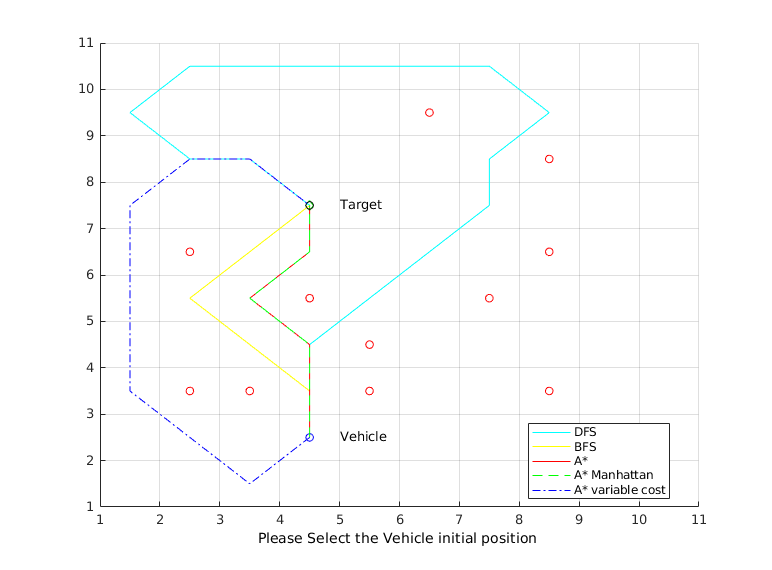

# Graph-based pathfinding algorithm

We compare the time and space complexity between three differents path finding algorithm: Depth First Search, Breadth First Search and A\*. To do so we buildt a 2D environment in which a robot must go from a point A to a point B. This environment has obstacles in it which the robot must avoid. We also investigate the influence of using different distance metrics (Euclidian and Manhattan) aswell as using variable cost across the different nodes.

## How to use

1. git clone https://github.com/StephaneSobucki/graph-path-algorithms
2. run main.m in MATLAB

## Example

In this example, we see the path found by each of the algorithm we chose.
Further details can be found in the report (time complexity, space complexity, influence of the distance metrics...)
